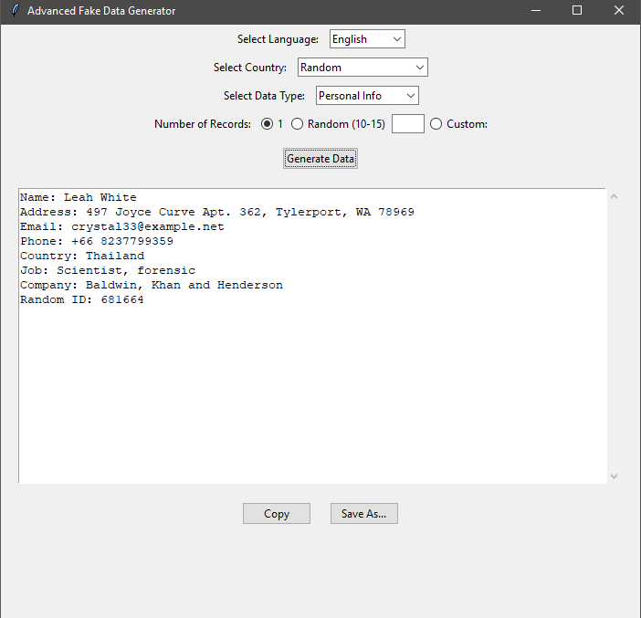

# Advanced Fake Data Generator

A modern, user-friendly Python application for generating realistic fake data for testing, QA, and educational purposes. Built with `tkinter` for a graphical interface and powered by the `Faker` library, this tool supports generating various types of data in multiple languages and countries.

## Features

- **Multilingual Support**: Generate data in English or Arabic with locale-specific formatting.
- **Country-Specific Data**: Select from a wide range of countries with corresponding phone codes and localized data.
- **Data Types**:
  - Personal Info (Name, Address, Email, Phone, Job, Company, etc.)
  - Credit Card Details
  - Phone Numbers
  - Country-Specific IDs (e.g., SSN, IQAMA, CPF, Aadhaar)
- **Flexible Output**:
  - Display data in a scrollable text area.
  - Copy generated data to clipboard.
  - Save data as TXT, CSV, or Excel files.
- **Customizable Record Count**: Generate 1 record, a random number (10-15), or a custom amount.
- **Responsive UI**: Clean and intuitive interface with support for dynamic language and country selection.

## Screenshots

*Main Interface (English)*


*Arabic Data Output*


*(Note: Add screenshots to the `screenshots/` folder and update paths accordingly.)*

## Installation

1. **Clone the Repository**:
   ```bash
   git clone https://github.com/3aed/Advanced-Fake-Data-Generator.git
   cd Advanced-Fake-Data-Generator
   ```

2. **Install Dependencies**:
   Ensure you have Python 3.7+ installed. Install required packages using:
   ```bash
   pip install -r requirements.txt
   ```

3. **Requirements**:
   Create a `requirements.txt` file with:
   ```
   faker
   openpyxl
   pyperclip
   ```

4. **Run the Application**:
   ```bash
   python Advanced_Fake_Data_Generator.py
   ```

## Usage

1. **Launch the App**: Run the script to open the GUI.
2. **Select Language**: Choose English or Arabic to adjust the data locale.
3. **Choose Country**: Select a specific country, or use "Random" for varied data.
4. **Pick Data Type**: Choose from Personal Info, Credit Card, Phone Number, or ID.
5. **Set Record Count**: Select 1, random (10-15), or enter a custom number.
6. **Generate Data**: Click "Generate Data" to display results in the text area.
7. **Save or Copy**:
   - Click "Copy" to copy data to the clipboard.
   - Click "Save As..." to export data as TXT, CSV, or Excel.

## Code Structure

- **Main File**: `Advanced_Fake_Data_Generator.py`
  - **GUI**: Built with `tkinter`, featuring a responsive interface with comboboxes, radio buttons, and a scrollable text area.
  - **Data Generation**: Uses `Faker` for localized data and custom logic for country-specific phone numbers and IDs.
  - **File Export**: Supports TXT, CSV, and Excel formats using `openpyxl` and `csv`.
  - **Clipboard**: Integrates `pyperclip` for copying generated data.

- **Key Components**:
  - `COUNTRY_CODES`: Dictionary mapping countries to phone codes.
  - `COUNTRY_LOCALES`: Maps countries to `Faker` locales for accurate data generation.
  - `ID_FORMATS`: Defines country-specific ID formats (e.g., SSN for the US, IQAMA for Saudi Arabia).
  - `generate_fake_data()`: Core function for generating structured data.
  - `FakeDataApp`: Class managing the GUI and user interactions.

## Contributing

Contributions are welcome! To contribute:

1. Fork the repository.
2. Create a new branch (`git checkout -b feature/your-feature`).
3. Make your changes and commit (`git commit -m "Add your feature"`).
4. Push to the branch (`git push origin feature/your-feature`).
5. Open a Pull Request.

Please ensure your code follows PEP 8 guidelines and includes appropriate comments.

## License

This project is licensed under the MIT License. See the [LICENSE](LICENSE) file for details.

## Credits

- **Author**: Aaed Hany FarajAllah
- **GitHub**: [3aed](https://github.com/3aed)
- **Purpose**: Created for educational purposes, QA testing, and data simulation.

## Future Enhancements

- Add support for more data types (e.g., bank account details, usernames).
- Expand country-specific ID formats.
- Include additional languages and locales.
- Add a preview mode for data before saving.

---

*This project is for educational and testing purposes only. Do not use generated data for illegal or unethical activities.*